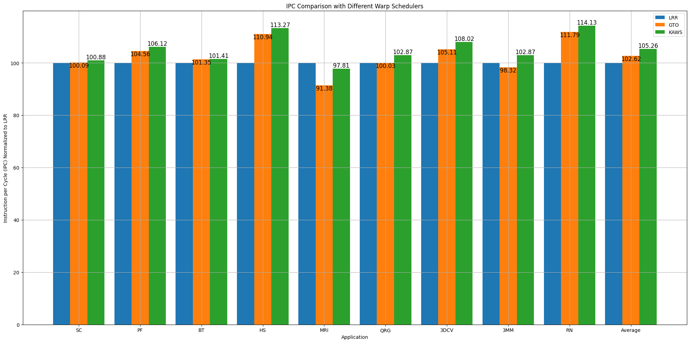

# COA End Semester Project - Group 10

## Group Members

- Ishan Mardani (21CS01023)
- Akshit Dudeja (21CS01026)
- Joshua Dias Barreto (21CS01075)
- Vishnu Tirth Bysani (21CS01077)
- Tushar Joshi (21CS01078)

# KAWS

## Kernel Aware Warp Scheduling

In normal scheduling policy, after the maximum number of CTAs (Cooperative Thread Arrays) have been issued to a SM, if a CTA finishes execution, there are no more CTAs left to be issued. This leads to resource underutilization. To prevent this we will use KAWS scheduling policy, which will do progress based scheduling after the last CTA has been issued to give more priority to processes with less progress or number instructions executed. This will help in finishing the execution of the last CTA faster and therfore, limit resource underutilisation.

 

# Warp Sharing Mechanism

A supplemental concept to KAWS, to reduce stall cycles, is to implement warp sharing. In this policy we utilize the available OCUs (Operand Collector Units) from all warp schedulers if the OCU corresponding to that specific warp instruction is not available in the scheduler that the process is currently allocated to.

 

# Modifications in Code

To see the changes in code, search for "_KAWS-Changes_" in the files shader.cc, shader.h, abstract_hardware_model.h, scheduler_id.h and gpgpusim_entrypoint.cc in the /EndSem_Project/gpgpu-sim_distribution/src.

 

# Evaluation

## IPC Performance of Different Warp Schedulers (Normalised to LRR)

## With and Without Warp Sharing (Normalised to LRR without Warp Sharing)

### KAWS

|                                              | PF     | HS     | 3DCV   | 3MM    |
| -------------------------------------------- | ------ | ------ | ------ | ------ |
| **With Warp Sharing**                        | 106.12 | 113.27 | 108.02 | 102.87 |
| **Without Warp Sharing**                     | 105.89 | 113.08 | 108.10 | 101.34 |
| **Performance Increase due to Warp Sharing** | 0.23   | 0.19   | -0.08  | 1.53   |

### GTO

|                                              | PF     | HS     | 3DCV   | 3MM   |
| -------------------------------------------- | ------ | ------ | ------ | ----- |
| **With Warp Sharing**                        | 104.56 | 110.94 | 105.11 | 98.32 |
| **Without Warp Sharing**                     | 104.48 | 110.75 | 105.19 | 96.80 |
| **Performance Increase due to Warp Sharing** | 0.08   | 0.19   | -0.08  | 1.52  |

### LRR

|                                              | PF     | HS     | 3DCV   | 3MM    |
| -------------------------------------------- | ------ | ------ | ------ | ------ |
| **With Warp Sharing**                        | 100.21 | 100.53 | 100.13 | 101.56 |
| **Without Warp Sharing**                     | 100    | 100    | 100    | 100    |
| **Performance Increase due to Warp Sharing** | 0.21   | 0.53   | 0.13   | 1.56   |
